apogee
-------

Tools for dealing with `SDSS-III <http://sdss3.org/>`__ `APOGEE
<http://www.sdss3.org/surveys/apogee.php>`__ and `SDSS-IV
<http://sdss.org/>`__ `APOGEE-2
<http://www.sdss.org/surveys/apogee-2/>`__ data.

.. contents::

AUTHOR
======

Main author: Jo Bovy - bovy at astro dot utoronto dot ca

Substantial contributions from

* Ted Mackereth (`@jmackereth <https://github.com/jmackereth>`__)
* Natalie Price-Jones (`@npricejones <https://github.com/npricejones>`__)
* Meredith Rawls (`@mrawls <https://github.com/mrawls>`__)

CITING THIS CODE
=================

Please cite `Bovy (2016) <http://arxiv.org/abs/1510.06745>`__ when
using this code. Appendix C of this paper has a brief overview of the
code. When using the selection function, please cite `Bovy et
al. (2014) <http://adsabs.harvard.edu/abs/2014ApJ...790..127B>`__ and
when using the DR14 selection function please cite `Mackereth & Bovy
(2020) <https://ui.adsabs.harvard.edu/abs/2019arXiv191003590M>`__ as
well. When using the effective selection function, please cite `Bovy
et al. (2016a) <http://arxiv.org/abs/1509.06751>`__ and/or `Bovy et
al. (2016b) <http://arxiv.org/abs/1509.05796>`__.

INSTALLATION
============

Standard python setup.py build/install

Either

``sudo python setup.py install``

or 

``python setup.py install --prefix=/some/directory/``

Installing FERRE
^^^^^^^^^^^^^^^^^

The installation can also automatically install Carlos Allende Prieto's `FERRE <http://leda.as.utexas.edu/ferre/>`__ code. To do this do

``python setup.py install --install-ferre``

On a Mac, you might have issues with OpenMP, which can be disabled
using ``--ferre-noopenmp``. The installation will also automatically
change FERRE's default filename-length from 120 to 180, to deal with
the long filenames for the model libraries on the SDSS SAS (which is
mirrored locally to use this code). If you want to use a different
filename-length you can specify, for example, ``--ferre-flen 200`` for
a length of 200 characters.

If you have already installed FERRE yourself, you should alias the
FERRE binary to ``ferre`` and FERRE's ascii2bin to ``ascii2bin`` to
use FERRE within this package.

Installing MOOG and Turbospectrum
^^^^^^^^^^^^^^^^^^^^^^^^^^^^^^^^^^

This package can also use `MOOG
<http://www.as.utexas.edu/~chris/moog.html>`__ and `Turbospectrum
<http://www.pages-perso-bertrand-plez.univ-montp2.fr/>`__. They are,
however, not installed by this package's installer. You can install
MOOG from the source given on the MOOG `website
<http://www.as.utexas.edu/~chris/moog.html>`__, or you can use
`@andycasey <https://github.com/andycasey>`__'s `MOOG installer
<https://github.com/andycasey/moog>`__ (updated to the July 2014
release of MOOG in the `batch.2014jul
<https://github.com/andycasey/moog/tree/batch.2014jul>`__ branch). You
can install this by cloning the ``moog`` repository, checking out the ``batch.2014jul`` branch, and running the installation::

    git clone https://github.com/andycasey/moog.git
    cd moog
    git checkout batch.2014jul
    python setup.py install

See the `MOOG installer <https://github.com/andycasey/moog>`__ webpage
for more info on the installation and its issues.

Turbospectrum v15.1 can be downloaded from Betrand Plez' `website
<http://www.pages-perso-bertrand-plez.univ-montp2.fr/>`__. To use
Turbospectrum with the ``apogee`` package, please define an
environment variable $TURBODATA that points to Turbospectrum's DATA
directory and make sure that the *babsma_lu* and *bsyn_lu* commands
are directly callable (by, for example, copying them to
/usr/local/bin). Here is an example installation::

		 wget http://www.pages-perso-bertrand-plez.univ-montp2.fr/DATA/Turbospectrum-v15.1.tar.gz
		 tar xvzf Turbospectrum-v15.1.tar.gz && cd EXPORT-15.1/exec-gf-v15.1
		 make
		 sudo cp babsma_lu /usr/local/bin && sudo chmod u+x /usr/local/bin/babsma_lu
		 sudo cp bsyn_lu /usr/local/bin && sudo chmod u+x /usr/local/bin/bsyn_lu
		 cd ../ && export TURBODATA=$PWD/DATA

DEPENDENCIES AND PYTHON VERSIONS
=================================

This package requires the Python packages `NumPy
<http://numpy.scipy.org/>`__, `Scipy <http://www.scipy.org/>`__,
`Matplotlib <http://matplotlib.sourceforge.net/>`__, `tqdm
<http://github.com/tqdm/tqdm>`__, `astropy
<https://github.com/astropy/astropy>`__, `esutil
<http://code.google.com/p/esutil/>`__, `galpy
<http://github.com/jobovy/galpy>`__, `isodist
<http://github.com/jobovy/isodist>`__, and `periodictable
<https://pypi.python.org/pypi/periodictable>`__. Because `esutil
<http://code.google.com/p/esutil/>`__ does not currently support
python 3, it is not listed as a dependency in the ``setup.py`` file
and must be installed separately; if ``esutil`` is not installed, some
functionality in ``apogee.tools.read`` is lost for which warnings are
issued. With standard installation, astropy is used to read FITS files. Installing `fitsio <http://github.com/esheldon/fitsio>`__ will cause those routines to take precedence over `astropy
<http://docs.astropy.org/en/stable/io/fits/index.html>`__.

The ``apogee`` package should work both in python 2 and 3 (thanks to
`@mrawls <https://github.com/mrawls>`__ for adding python 3
compatibility). Please open an `issue
<https://github.com/jobovy/apogee/issues>`__ if you find a part of the
code that does not support python 3.

To use the download functionalities (see below), you also need to have
``wget`` installed on your system.

DATA FILES AND ENVIRONMENT VARIABLES
=====================================

This code depends on a number of data files and environment
variables. The environment variables are (**WARNING: THESE HAVE
RECENTLY CHANGED TO BE MORE CONSISTENT WITH SDSS' OWN ENVIRONMENT
VARIABLES**)

* **SDSS_LOCAL_SAS_MIRROR**: top-level directory that will be used to (selectively) mirror the SDSS SAS
* **RESULTS_VERS**: APOGEE reduction version (e.g., v304 for DR10, v402 for DR11, v603 for DR12, l30e.2 for DR13, l31c.2 for DR14, l33 for DR16); note that you can set and change the DR on the fly using the function ``change_dr`` in ``apogee.tools.path`` (also available in ``apogee.tools.read`` for convenience).
* **APOGEE_APOKASC_REDUX**: APOKASC catalog version (e.g., v6.2a); note that this does not load the public catalog and is only for internal SDSS use.

In order to use this code, you will need to set these environment variables
on your machine with commands like `export SDSS_LOCAL_SAS_MIRROR="/desired/path/to/SDSS/data"`
which can be saved in `~/.bashrc` or a similar file.

**NEW**: Data files mirror the SDSS SAS as much as possible
(previously, many data files lived in the $SDSS_LOCAL_SAS_MIRROR
directory, then known as the $APOGEE_DATA directory). Some files still
live directly under the $SDSS_LOCAL_SAS_MIRROR directory (for example,
APOKASC_Catalog.APOGEE_$APOKASC_REDUX.fits). Files related to the
spectra and the target selection live in sub-directories
**drXX/**. These sub-directories mirror the directory structure of
spectra- and targeting-related files on the SDSS-III `SAS
<http://data.sdss3.org/sas/dr12/apogee>`__:

* **$SDSS_LOCAL_SAS_MIRROR/dr12/apogee/target/**

with sub-directories in that last *target/* directory

* **apogee_DR12**

These directories contain the apogeeDesign_DR12.fits,
apogeeField_DR12.fits, apogeePlate_DR12.fits, and
apogeeObject_DR12-FIELDNAME.fits files (for DR10/DR11 there are
similar directories).

For the target selection code to work, the allStar-$RESULTS_VERS.fits,
allVisit-$RESULTS_VERS.fits files need to be present, as well as the
targeting files in the *drXX/* directories. The observation log
obs-summary-year1+2.csv (for DR11) or obs-summary-year1+2+3.csv (for
DR12) also needs to be present. These are available `here
<https://zenodo.org/record/17300>`__ and they will be automagically
downloaded by the code when they are needed.

Files of individual spectra live in directories that mirror the SAS as
well:

* **$SDSS_LOCAL_SAS_MIRROR/dr12/apogee/spectra/**

Routines in the *apogee.tools.path* module keep track of all of the
paths to the different files. A typical tree looks something like::

      $SDSS_LOCAL_SAS_MIRROR/
	dr12/
		apogee/
			spectro/
				redux/r5/stars/
					apo25m/
						4102/
							apStar-r5-2M21353892+4229507.fits
							...
						...
					apo1m/
						hip/
							apStar-r5-2M00003088+5933348.fits
							...
						...
					l25_6d/v603/
						allStar-v603.fits
						allVisit-v603.fits
						4102/
							aspcapStar-r5-v603-2M21353892+4229507.fits
							...
						...
			target/
				apogee_DR12/
					apogeeDesign.fits
					apogeeField.fits
					apogeeObject_000+02.fits
					...
					apogeePlate.fits
			vac/
				apogee-rc/cat/
					apogee-rc-DR12.fits
					...
	dr10/
	   *similar to dr12/*

**The apogee package will automatically attempt to download most of
the data files, so provided you have setup SDSS_LOCAL_SAS_MIRROR and
RESULTS_VERS, you will not have to download data files yourself to get
started.** If you have access to proprietary data, you have to setup a
.netrc file with the correct login credentials (see `here
<https://trac.sdss3.org/wiki/Software/NetRc>`__). Please let me know
if there are files that you would like to have added to the automatic
downloading.

BASIC USE
==========

File reading
^^^^^^^^^^^^^

The most basic capability of the code is to read various data produces
and apply cuts (in *apogee.tools.read*). For example::

   import apogee.tools.read as apread
   allStar= apread.allStar(rmcommissioning=True,main=False,ak=True, akvers='targ',adddist=False)

will read the allStar file corresponding to the $RESULTS_VERS version,
remove stars only observed on commissioning plates
(*rmcommissioning=True*), only keep stars with a valid extinction
estimate (*ak=True*), and use the original extinction estimate used to
define the targeting sample (*akvers='targ'*). The output
numpy.recarray has additional tags containing the extinction-corrected
*J*, *H*, and *K*\ :sub:`s` magnitudes.

The *allStar* read function also has an option *rmdups=True* (default:
False) that removes a small number of duplicates in the allStar file
(these are mainly commissioning stars re-observed during the main
survey and a few stars in overlapping fields). The first time this
option is used the read function may take about 10 minutes to remove
all duplicates, but the duplicate-free file is then cached for
re-use. Use as::

	allStar= apread.allStar(rmcommissioning=True,rmdups=True)

If you are using DR14 and want to use the (less noisy) parameters and
abundances derived using the `astroNN
<https://github.com/henrysky/astroNN_spectra_paper_figures>`__ method
of `Leung & Bovy (2019a) <https://arxiv.org/abs/1808.04428>`__, the
distances to APOGEE stars determined using a neural-network approach
trained on Gaia by Leung & Bovy (2019b; in prep.), and the ages from
`Mackereth, Bovy, Leung, et al. (2019)
<http://arxiv.org/abs/1901.04502>`__ do::

   allStar= apread.allStar(use_astroNN=True)

which can also be combined with any other ``allStar`` option. The
``astroNN`` results are swapped in for the regular ASPCAP results, so
switching between the two is as simple as changing the read of the
file. The recommended distances are ``weighted_dist`` (pc) and the
ages are ``astroNN_age``.  You can load only the astroNN abundances,
only the distances, or only the ages using ``use_astroNN_abundances``,
``use_astroNN_distances``, and ``use_astroNN_ages``, respectively.

We can read the red-clump catalog from `Bovy et al. (2014) <http://adsabs.harvard.edu/abs/2014ApJ...790..127B>`__  using (any of its releases)::

   aporc= apread.rcsample()

This can also take the ``use_astroNN=True`` option to swap in the astroNN parameters and abundances.

We can also read spectra as follows::

   spec, hdr= apread.apStar(4102,'2M21353892+4229507',ext=1)

where the first argument is the location ID and the second argument is
the APOGEE ID. This reads the first extension of the `apStar
<http://data.sdss3.org/datamodel/files/APOGEE_REDUX/APRED_VERS/APSTAR_VERS/TELESCOPE/LOCATION_ID/apStar.html>`_
file; the header is also returned (set ``header=False`` to not read
the header). Similarly, we can read pseudo-continuum-normalized
spectra as::

	spec, hdr= apread.aspcapStar(4102,'2M21382701+4221097',ext=1)

For objects observed with the NMSU 1m telescope (those with
``TELESCOPE`` tag set to ``apo1m``), we need to specify the ``FIELD``
rather than the location ID. That is, do for example::

       spec, hdr= apread.apStar('hip','2M00003088+5933348',ext=1)

and::

	spec, hdr= apread.aspcapStar('hip','2M00003088+5933348',ext=1)

The ``FIELD`` can be directly fed from the allStar entry (whitespace
will be automatically removed).

Spectra will also be automatically downloaded if they are not
available locally. Module **apogee.tools.read** also contains routines
to read the various targeting-related files (see above). These are
*not* automatically downloaded at this point. 

You can set and change the DR on the fly using the function
``change_dr`` in ``apogee.tools.path``. Many (but not all) functions
allow a ``dr=`` keyword that allows one to specify the data release,
but using ``change_dr`` allows you to change the data release without
having to specify it for every function (and also allows you to change
it for functions that do not support the ``dr=`` keyword).

We can also read individual apVisit files, provided the plate ID, MJD, and fiber are known.
Otherwise, it functions similarly to how you would read in an apStar file. If you are interested
in a particular target and don't know the plate ID, MJD, and fiber *a priori*, the `SDSS Science
Archive Server (SAS) <https://dr14.sdss.org/infrared/spectrum/search>`__
for your DR of choice can be of great use. At present, up to DR14 is supported.

Note that apVisit data is **not** on the standard apogee wavelength grid, and `ext=4` must be used to
retrieve the wavelength data that corresponds with the fluxes. An example::

    import apogee.tools.read as apread
    plateId = 7439
    mjd = 56763
    fiberId = 207
    spec = apread.apVisit(plateId, mjd, fiberId, ext=1)
    specerr = apread.apVisit(plateId, mjd, fiberId, ext=2)
    wave = apread.apVisit(plateId, mjd, fiberId, ext=4)
    header = apread.apVisit(plateId, mjd, fiberId, ext=0, header=True)
    
Note that you may access either data **OR** header information with a single call
to `apread.apVisit`. Take care when specifying which FITS extension you want.

If you wish to continuum normalize an apVisit spectrum, you can! The procedure is slightly different
from normalizing a series of apStar spectra (see the section on "The APOGEE LSF and continuum normalization"
below if you are working with apStar files). Most notably, `continuum.fitApvisit` takes only one spectrum
at a time::

    from apogee.spec import continuum
    cont = continuum.fitApvisit(spec, specerr, wave)
    specnorm = spec/cont

Use regular matplotlib commands to view the result rather than the specialized plotting tools in this 
module, because the latter is built with an underlying assumption of the standard apStar wavelength grid.
For example::

    import matplotlib.pyplot as plt
    plt.plot(wave, spec)
    plt.plot(wave, cont, lw=2, color='r')
    plt.show()
    plt.plot(wave, specnorm)
    plt.show()

Bitmasks
^^^^^^^^^

The module **apogee.tools.bitmask** has some tools for dealing with APOGEE
bitmasks. In particular, it has methods to turn a numerical bit value
into the string name of the bit::

     from apogee.tools import bitmask
     bitmask.apogee_target1_string(11)
     'APOGEE_SHORT'
     bitmask.apogee_target2_string(9)
     'APOGEE_TELLURIC'

Or we can find the numerical bit value for a given string name::

   bitmask.apogee_target1_int('APOGEE_SHORT')
   11
   bitmask.apogee_target2_int('APOGEE_TELLURIC')
   9

There are also tools to figure out which bits are set for a given
bitmask from the catalog and to test whether a given bit is set::

	bitmask.bits_set(-2147481584)
	[4, 11, 31]
	bitmask.bit_set(1,-2147481584)
	False
	bitmask.bit_set(bitmask.apogee_target2_int('APOGEE_TELLURIC'),-2147481584)

The final command run on an array of bitmasks will return a boolean
index array of entries for which this bit is set. For example, to get
the tellucircs in the allStar file do::

    telluricsIndx= bitmask.bit_set(bitmask.apogee_target2_int('APOGEE_TELLURIC'),allStar['APOGEE_TARGET2'])

or shorter::

    telluricsIndx= bitmask.bit_set(9,allStar['APOGEE_TARGET2'])

If you want a quick reminder of what the various bits are, just
display the bitmask dictionaries::

   bitmask.APOGEE_TARGET1
   {0: 'APOGEE_FAINT',
    1: 'APOGEE_MEDIUM',
    2: 'APOGEE_BRIGHT',
    3: 'APOGEE_IRAC_DERED',
    ...}
   bitmask.APOGEE_TARGET2
   {1: 'APOGEE_FLUX_STANDARD',
    2: 'APOGEE_STANDARD_STAR',
    3: 'APOGEE_RV_STANDARD',
    ...}

Plotting
^^^^^^^^

The ``apogee`` module also contains some functionality to plot the
APOGEE spectra in ``apogee.spec.plot``. For example, to make a nice
plot of the pseudo-continuum-normalized aspcapStar spectrum of entry
3512 in the subsample of S/N > 200 stars in the DR12 red-clump
catalog, do::

   import apogee.tools.read as apread
   import apogee.spec.plot as splot
   data= apread.rcsample()
   indx= data['SNR'] > 200.
   data= data[indx]
   splot.waveregions(data[3512]['LOCATION_ID'],data[3512]['APOGEE_ID'],ext=1,
                     labelID=data[3512]['APOGEE_ID'],
		     labelTeff=data[3512]['TEFF'],
		     labellogg=data[3512]['LOGG'],
		     labelmetals=data[3512]['METALS'],
		     labelafe=data[3512]['ALPHAFE'])

which gives

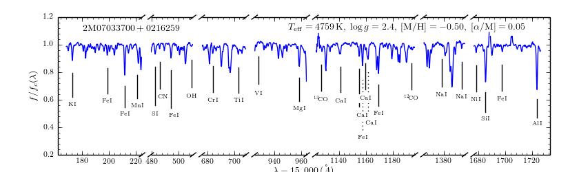
		
``apogee.spec.plot.waveregions`` can plot arbitrary combinations of
wavelength regions specified using (``startlams=``, ``endlams=``) or
(``startindxs=``, ``endindxs=``) to either specify starting/ending
wavelengths or indices into the wavelength array. The default displays
a selection of regions chosen to have every element included in the
standard APOGEE abundance analysis. If ``labelLines=True`` (the
default), strong, clean lines from `Smith et al. (2013)
<http://adsabs.harvard.edu/abs/2013ApJ...765...16S>`__ are labeled. We
can also overlay the best-fit model spectrum::

   splot.waveregions(data[3512]['LOCATION_ID'],data[3512]['APOGEE_ID'],'r-',
                     ext=3,overplot=True,
                     labelID=data[3512]['APOGEE_ID'],
		     labelTeff=data[3512]['TEFF'],
		     labellogg=data[3512]['LOGG'],
		     labelmetals=data[3512]['METALS'],
		     labelafe=data[3512]['ALPHAFE'])

which gives

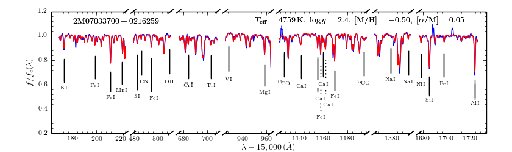
		
By plotting the error array (``ext=2``) you can see that the regions
with a large discrepancy between the model and the data are regions
with large errors (due to sky lines).

The same ``apogee.spec.plot.waveregions`` can also plot the
non-continuum-normalized spectrum (``apStar`` in APOGEE parlance)::

   splot.waveregions(data[3512]['LOCATION_ID'],data[3512]['APOGEE_ID'],ext=1,
		     apStar=True,labelID=data[3512]['APOGEE_ID'],
		     labelTeff=data[3512]['TEFF'],
		     labellogg=data[3512]['LOGG'],
		     labelmetals=data[3512]['METALS'],
		     labelafe=data[3512]['ALPHAFE'])

which gives

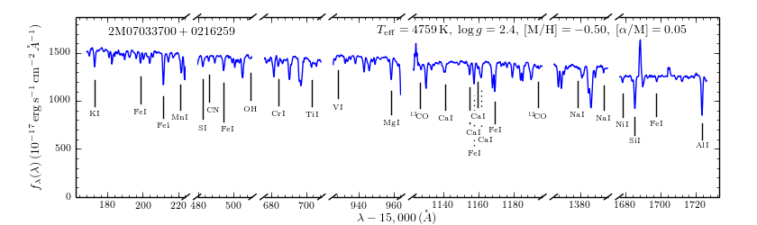

To plot a whole detector, use ``apogee.spec.plot.detector`` in the
same way, but specify the detector (``'blue'``, ``'green'``, or
``'red'``) as an additional argument. For example::
   
   splot.detector(data[3512]['LOCATION_ID'],data[3512]['APOGEE_ID'],
                  'blue',ext=1,labelLines=False,
                  labelID=data[3512]['APOGEE_ID'],
                  labelTeff=data[3512]['TEFF'],
                  labellogg=data[3512]['LOGG'],
                  labelmetals=data[3512]['METALS'],
                  labelafe=data[3512]['ALPHAFE'])

which gives

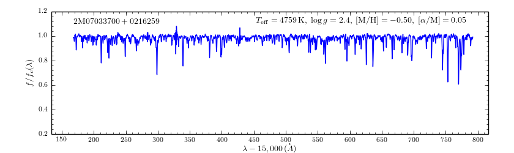

We haven't labeled the lines here, because there are so
many. Similarly, the green and red detector are given by::

   splot.detector(data[3512]['LOCATION_ID'],data[3512]['APOGEE_ID'],
                  'green',ext=1,labelLines=False,
                  labelID=data[3512]['APOGEE_ID'])

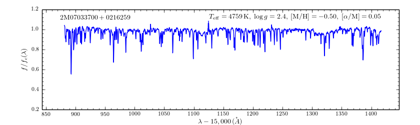

and::

   splot.detector(data[3512]['LOCATION_ID'],data[3512]['APOGEE_ID'],
                  'red',ext=1,labelLines=False,
                  labelID=data[3512]['APOGEE_ID'])

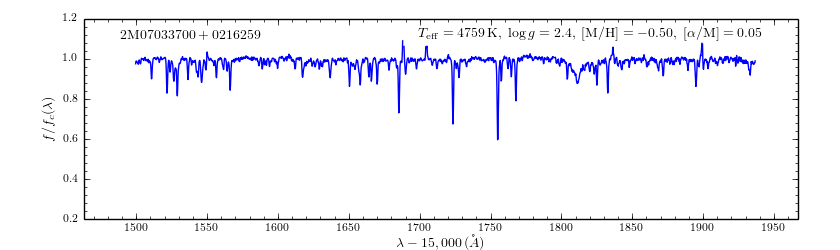

If you want even more detail, check out ``apogee.spec.plot.highres``,
which returns an iterator over a 12-panel plot of the spectrum,
allowing much detail to be seen in the spectrum. With
``apogee.spec.plot.highres2pdf`` you can save these 12 panels to a 12
page PDF file.

It is also possible to plot the parts of a spectrum corresponding to
the abundance windows used by APOGEE's abundance determination. For
example, to plot the spectrum and the best fit for the window for Si
do::

	 splot.windows(data[3512]['LOCATION_ID'],data[3512]['APOGEE_ID'],'Si')
	 splot.windows(data[3512]['LOCATION_ID'],data[3512]['APOGEE_ID'],'Si',ext=3,overplot=True)

.. |Angstrom| unicode:: U+212B .. Angstrom sign

which gives (each ``x`` tick mark is 2 |Angstrom|)

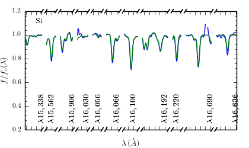

``C``, ``N``, ``O``, and ``Fe`` have so many windows that a single plot
becomes overcrowded, so for those elements you have the option to plot
the first half or the second half of the windows by giving the element
as ``C1`` or ``C2``, respectively::

   splot.windows(data[3512]['LOCATION_ID'],data[3512]['APOGEE_ID'],'Fe1')
   splot.windows(data[3512]['LOCATION_ID'],data[3512]['APOGEE_ID'],'Fe1',ext=3,overplot=True)

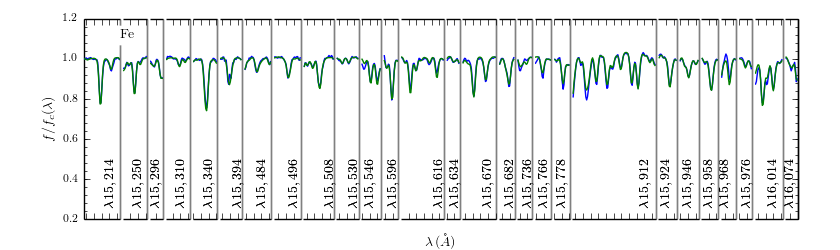

``apogee.spec.plot.windows`` also has the option to overplot the weights of the windows. For example::

     splot.windows(data[3512]['LOCATION_ID'],data[3512]['APOGEE_ID'],'Al',plot_weights=True)

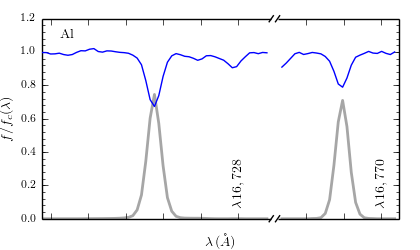

The module ``apogee.spec.window`` has various utilities to deal with
the windows.
		
ANALYZING SPECTRA
==================

Generating model spectra
^^^^^^^^^^^^^^^^^^^^^^^^^

``apogee.modelspec`` contains various ways to generate model spectra
for APOGEE spectra. The easiest way is to use grids generated for
APOGEE data analysis and use FERRE (see above) to interpolate on these
grids. Using MOOG or Turbospectrum allows for more flexibility, but
this functionality is currently under development.

Using APOGEE model grids (using FERRE)
+++++++++++++++++++++++++++++++++++++++

To use the APOGEE model grids for interpolation, you first need to
download the grids. This can be done using::

	 from apogee.tools import download
	 download.ferreModelLibrary(lib='GK',pca=True,sixd=True,unf=False,dr=None,convertToBin=True)

This command downloads the main 6D, PCA-compressed 'GK' library used
for cooler stars (use ``lib='F'`` for hotter grids). ``unf=False``
means that the ascii version of the library is downloaded and
``convertToBin=True`` converts this ascii library to a binary format
(there is a .unf file available for download, but because the binary
format is not machine independent, it is recommended to convert to
binary locally). **Because the model libraries are quite large, these
are not downloaded automatically, so you need to run this command to
download the library**. Currently only DR12 grids are supported.

With this library, you can generate model spectra using (see below for
an alternative method)::

     from apogee.modelspec import ferre
     mspec= ferre.interpolate(4750.,2.5,-0.1,0.1,0.,0.)

which returns a model spectrum on the apStar wavelength grid for
``Teff=4750``, ``logg=2.5``, ``metals=-0.1``, ``alphafe=0.1``,
``nfe=0.0``, and ``cfe=0.0`` (in that order). You could plot this, for
example, with the ``apogee.spec.plot.waveregions`` command above.

Providing an array for each of the 6 (or 7 if you use a library that
varies the microturbulence) input parameters returns a set of
spectra. For example::

	 teffs= [4500.,4750.]
	 s= numpy.ones(2)
	 mspec= ferre.interpolate(teffs,2.5*s,-0.1*s,0.1*s,0.*s,0.*s)
	 mspec.shape
	 (2, 8575)

Asking for tens of spectra simultaneously is more efficient, because
you only need to run the FERRE setup once (but it becomes inefficient
for many hundreds...).

An alternative method for generating interpolated spectra from the
grids is to use an ``Interpolator`` instance, which keeps FERRE
running in the background and is thus more efficient at interpolating
individual spectra. These are set up as::

      ip= ferre.Interpolator(lib='GK')

and can then be used as::

    mspec= ip(4750.,2.5,-0.1,0.1,0.,0.)

To properly clean up, the instance should be closed before exiting::

   ip.close()

``ferre.Interpolator`` instances can also be used as a *context
manager*, which automatically takes care of the necessary clean-up in
case of an Exception::

     with ferre.Interpolator(lib='GK') as ip:
     	  mspec= ip(4750.,2.5,-0.1,0.1,0.,0.)

The APOGEE LSF and continuum normalization
+++++++++++++++++++++++++++++++++++++++++++

The grids that are interpolated above are already convolved with the
APOGEE LSF and are continuum normalized using the standard
APOGEE/ASPCAP approach. When generating model spectra with other
software tools (like MOOG below) one needs to convolve the model
spectra with the APOGEE LSF and apply continuum normalization. This
section briefly describes the tools available in this package for
doing this.

Tools for handling the APOGEE LSF are in the ``apogee.spec.lsf``
module. The most important functions here are ``lsf.eval`` and
``lsf.convolve``. ``lsf.eval`` evaluates the LSF for a given fiber (or
an average of several fibers) on a grid of pixel offsets (in units of
the apStar logarithmic wavlength grid). These pixel offsets need to
have a spacing ``1/integer`` and the LSF will be evaluated on the
apStar wavelength grid subdivided by the same amount (so if
``integer=3``, the ouput will be on the apStar wavelength grid in
pixel,pixel+1/3,pixel+2/3, pixel+1, etc.). This allows the convolution
to be performed efficiently.

``lsf.convolve`` convolves with both the APOGEE LSF and the
macroturbulence and outputs the spectrum on the standard apStar
logarithmically-spaced wavelength grid. The macroturbulence can either
be modeled as a Gaussian smoothing with a given FWHM or the proper
macroturbulence convolution kernel can be pre-computed using
``apogee.modelspec.vmacro`` in the same way as the ``lsf.eval``
function above. The convolutions are implemented efficiently as a
sparse-matrix multiplication. The LSF obtained from ``lsf.eval`` and
the macroturbulence kernel from ``apogee.modelspec.vmacro`` can be
returned in this sparse format by specifying ``sparse=True`` or you
can yourself compute the sparse representation by running
``lsf.sparsify``. If for some reason you do not wish to convolve with
the APOGEE LSF, you can compute a dummy LSF using ``lsf.dummy`` that
is just a delta function and this can be passed to ``lsf.convolve``
(useful for only convolving with macroturbulence).

The average DR12 LSFs for 6 fibers (the standard LSF for ASPCAP
analysis) or for all fibers is pre-computed and stored online at `this
URL <http://dx.doi.org/10.5281/zenodo.16147>`__. They can be
downloaded and loaded using ``lsf._load_precomp``. Various of the
spectral analysis functions described below automatically download and
load these LSFs.

An example of the LSF and macroturbulence functions is displayed
below: this shows the average LSF of all APOGEE fibers, the proper
macroturbulence kernel, and a Gaussian macroturbulence kernel (which
is used in the standard APOGEE analysis):

.. image:: _readme_files/lsf_vmacro_example.png

``apogee.spec.lsf`` also contains functions to deal with the raw
LSF. This includes the ``wavelength->pixel`` and ``pixel->wavelength``
solution, unpacking the parameters of the LSF, and evaluating the raw
LSF using the LSF parameters.

Tools for working with the continuum normalization are included in
``apogee.spec.continuum``. The main routine that is useful is
``continuum.fit`` which fits the continuum to a set of spectra and
their uncertainties using one of two methods (specified using the
``type=`` keyword) and returns the continuum for each spectrum. 

The first method is ``type='aspcap'``, which is also the default. This
is an implementation of the default APOGEE/ASPCAP
continuum-normalization in data releases < 14 (see Garcia Perez et
al. 2015), which iteratively searches for the upper envelope of the
spectrum. An example of this procedure is the following::

	aspec= apread.apStar(4159,'2M07000348+0319407',ext=1,header=False)[1]
	aspecerr= apread.apStar(4159,'2M07000348+0319407',ext=2,header=False)[1]
	# Input needs to be (nspec,nwave)
	aspec= numpy.reshape(aspec,(1,len(aspec)))
	aspecerr= numpy.reshape(aspecerr,(1,len(aspecerr)))
	# Fit the continuum
	from apogee.spec import continuum
	cont= continuum.fit(aspec,aspecerr,type='aspcap')

We can then compare this to the official continuum-normalized spectrum
in ``aspcapStar``::

	cspec= apread.aspcapStar(4159,'2M07000348+0319407',ext=1,header=False)
	import apogee.spec.plot as splot
	splot.waveregions(aspec[0]/cont[0])
	splot.waveregions(cspec,overplot=True)
	
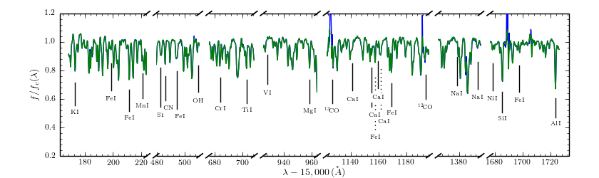

which demonstrates very good agreement.

In DR14, ASPCAP changed its pseudo-continuum normalization from an iterative search to a simple fourth-order polynomial fit. This can be done using the code above by specifying ``niter=0`` in the call to ``continuum.fit``.

The second method is ``type='cannon'``, which is an implementation of
a Cannon-style continuum-normalization (see `Ness et al. 2015
<http://arxiv.org/abs/1501.07604>`__; see below). This method uses a
pre-determined set of continuum pixels, which can be specified through
``cont_pixels=``. A default set of pixels is included in the code;
there is also a function ``continuum.pixels_cannon`` that can
determine the continuum pixels. For the same star as analyzed with the
ASPCAP continuum normalization above we find::

       cont_cannon= continuum.fit(aspec,aspecerr,type='cannon')
       splot.waveregions(aspec[0]/cont_cannon[0])
       splot.waveregions(cspec,overplot=True)

which gives

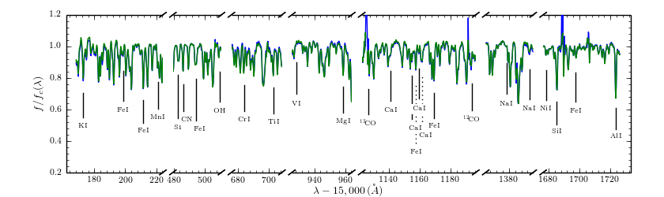

In the wavelength region shown, the two methods agree nicely (but they
do not over the full wavelength range).

Working with model atmospheres
+++++++++++++++++++++++++++++++

Generating synthetic spectra as discussed below for MOOG requires
having a model atmosphere. `Meszaros et
al. <http://adsabs.harvard.edu/abs/2012AJ....144..120M>`__ have
computed a grid of ATLAS9 model atmospheres varying effective
temperature, surface gravity, overall metallicity, and the relative
enhancement of carbon and alpha elements. ``apogee`` has tools to work
with these in the ``apogee.modelatm`` module. This grid can be
downloaded on `this website
<http://www.iac.es/proyecto/ATLAS-APOGEE/>`__; APOGEE collaborators
can also use the ``apogee.tools.download.modelAtmosphere`` function to
download these. Currently, the atmospheres must be put into a
``apogeework/apogee/spectro/redux/speclib/kurucz_filled`` subdirectory
of the overall ``$SDSS_LOCAL_SAS_MIRROR`` data directory (see above); the
``download.modelAtmosphere`` function automatically puts the model
atmospheres in the correct location. The functions in
``apogee.modelatm`` will also automatically download the necessary
atmospheres, so no setup should be required for collaboration members.

ATLAS9 model-atmosphere functionality is included in
``apogee.modelatm.atlas9``. The main use of this module is that it
contains a class ``Atlas9Atmosphere``; instances of this class are
individual atmospheres and the instance allows one to inspect its
structure as a function of optical depth and to write the model
atmosphere to a file (useful for using the atmosphere with MOOG
below).

For example, to load a grid point do::

    from apogee.modelatm import atlas9
    atm= atlas9.Atlas9Atmosphere(teff=4750.,logg=2.5,metals=-0.25,am=0.25,cm=0.25)

One can then look at, for example, the thermal structure::

    atm.plot('T')

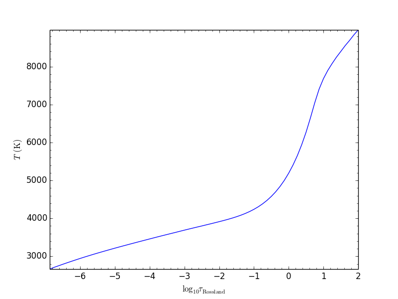

or the gas pressure::

   atm.plot('P')

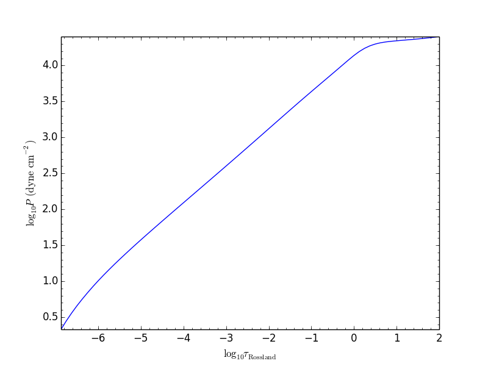

The ``apogee.modelatm.atlas9`` module also contains a rudimentary
model-atmosphere interpolator. This uses linear interpolation within
the hypercube of nearby grid points and means that one can load
non-grid-point atmospheres in the same way as above::

    atm_ng= atlas9.Atlas9Atmosphere(teff=4850.,logg=2.65,metals=-0.3,am=0.15,cm=0.05)

Comparing this to the grid-point atmosphere above::

	  atm.plot('T')
	  atm_ng.plot('T',overplot=True)

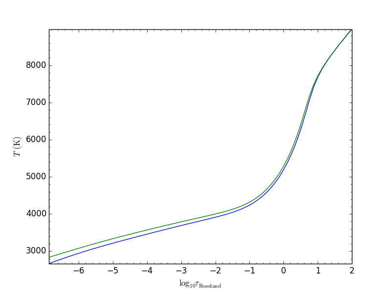
	  
and::

	atm.plot('P')
	atm_ng.plot('P',overplot=True)

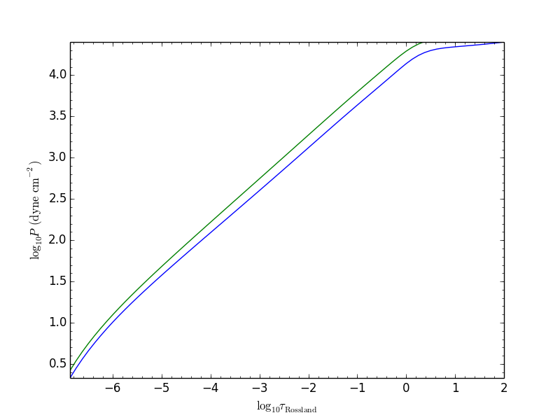

All model atmospheres can be written to a file in KURUCZ format using ``writeto``, for example::

    atm_ng.writeto('test.mod')

Only essential parts of the atmosphere are written out here, so don't
be alarmed that the top lines of the file don't match the model
atmosphere.

Using MOOG
+++++++++++

Synthetic spectra using `MOOG
<http://www.as.utexas.edu/~chris/moog.html>`__ can be generated using
functions in the ``apogee.modelspec.moog`` module. The main functions
in this module are ``moog.synth`` and ``moog.windows``, which provide
high-level interfaces to MOOG. They both synthesize an arbitrary
number of spectra for arbitrary combinations of abundances of
individual elements, convolve with the APOGEE LSF and macroturbulence,
put the synthetic spectrum on the apStar logarithmic wavelength scale,
and perform continuum-normalization (see above). The use of
``moog.synth`` is to generate synthetic spectra over the full APOGEE
wavelength range, ``moog.windows`` can be used to only vary the
spectrum within certain windows (although full APOGEE wavelength
spectra are returned also for ``moog.windows``; see below). There is
also a lower-level interface to MOOG, ``moog.moogsynth``, which allows
more direct access to MOOG's ``synth`` and ``doflux`` drivers, and
``moog.weedout``, which allows MOOG's ``weedout`` driver to be
run. These are not further discussed here.

The inputs to ``moog.synth`` and ``moog.windows`` are by and large the
same. Both take an arbitrary number of lists as their first inputs,
which specify the element to vary and the abundance relative to the
default abundance in the provided model atmosphere. For example, to
vary the iron abundance by -0.25 and 0.25 dex, the input would be
[26,-0.25,0.25]; to also vary the titanium abundance one would also
provide a list [22,-0.3] (lists do not all have to have the same
length; they are zero-padded). 

The model atmosphere can be provided in a variety of ways. The first
is to give a model-atmosphere instance as discussed above as the
keyword ``modelatm=`` (this keyword can also be the name of file
holding the model atmosphere). Alternatively, the stellar parameters
of the atmosphere can be provided (``teff=``, ``logg=``, ``metals=``,
``cm=``, and ``am=``; they can also be provided as an ``fparam=``
array similar to the arrays coming out of ASPCAP [see below]). One
also has to specify the microturbulence (``vmicro=``, or as part of
``fparam=``).

To perform the synthesis we need a line list. This can be passed as
the ``linelist=`` keyword. This can be set to a filename or just to
the name of an APOGEE line list for APOGEE collaborators (linelists
can be downloaded using ``apogee.tools.download.linelist``; make sure
to also download the ``stronglines.vac`` linelist). Isotopic ratios
can be set to either ``isotopes='solar'`` or ``isotopes='arcturus'``
for typical dwarf or giant isotope ratios. The method for downloading
MOOG linelists currently implemented here is only accessible to APOGEE
collaboration members, although the DR12 linelist is publicly
available; it has to be obtained independently from this code. A
Turbospectrum version of the (corrected) DR12 linelist *can* be
automatically downloaded by the code (see below).

The LSF can be given as the ``lsf=`` keyword. This can be set to the
output of ``apogee.spec.lsf.eval`` (best if it's a sparse version of
this output; see above), in which case you also have to specify the
pixel offsets at which the LSF is calculated as ``xlsf=`` or
``dxlsf``. Alternatively, you can just say ``lsf='all'`` or
``lsf='combo'`` to use an average LSF of all fibers or a combination
of 6 fibers (see the section on the LSF above).

Macroturbulence can be set using the ``vmacro=`` keyword. This can be
a number for a Gaussian macroturbulence, or it can be set to the
output of ``apogee.modelspec.vmacro`` for a more realistic treatment
of macroturbulence (again, see the LSF section above).

Continuum normalization can be done in one of three ways:
``cont='aspcap'`` (the default) which is an implementation of the
standard continuum normalization performed by ASPCAP;
``cont='cannon'`` for the Cannon-style normalization described above;
or ``cont='true'`` for using the true continuum.

Putting all of this together, we can generate the synthetic spectra
for the two abundances given above and for the atmosphere above as
follows (we repeat the setup of the model atmosphere and explicitly
set many of the parameters to their default values)::

	import apogee.modelspec.moog
	from apogee.modelatm import atlas9
	atm= atlas9.Atlas9Atmosphere(teff=4750.,logg=2.5,metals=-0.25,am=0.25,cm=0.25)
	# The following takes a while ...
	synspec= apogee.modelspec.moog.synth([26,-0.25,0.25],[22,-0.3],modelatm=atm,\
		 linelist='moog.201312161124.vac',lsf='all',cont='aspcap',vmacro=6.,isotopes='solar')
	
and we can plot these::

    import apogee.spec.plot as splot
    splot.waveregions(synspec[0])
    splot.waveregions(synspec[1],overplot=True)

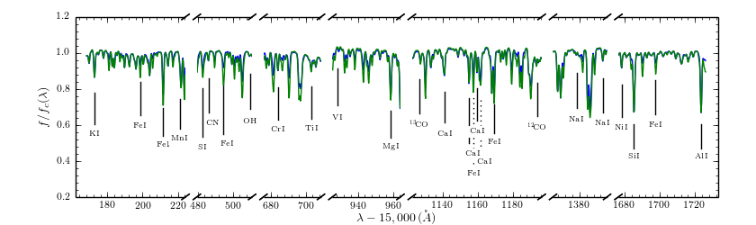

``apogee.moog.windows`` can generate synthetic spectra for which only
a set of windows are varied. Typical use of this function is with the
``apogee.spec.window`` functions that specify the windows for
different element species. However, arbitrary windows can be specified
using the ``startindxs`` and ``endindxs`` or ``startlams`` and
``endlams`` arguments (similar to ``apogee.spec.plot.waveregions``);
they need to be given before any abundance changes. For example, to
vary the aluminum abundance for the off-grid model atmosphere above in
the APOGEE aluminum windows do::

	  abu= [13,-1.,-0.75,-0.5,-0.25,0.,0.25,0.5,0.75,1.]
	  synspec= apogee.modelspec.moog.windows('Al',abu,modelatm=atm_ng,\
	  	   linelist='moog.201312161124.vac')

and we can plot the aluminum windows::

    splot.windows(synspec[0],'Al')
    for ii in range(1,len(abu)-1): splot.windows(synspec[ii],'Al',overplot=True)

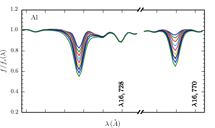

The ``moog.windows`` synthesis is performed by first synthesizing a
single full APOGEE wavelength spectrum to use as a baseline and then
generating multiple synthetic spectra in the requested windows for
which the baseline is used outside of the window. For most elements of
interest this is very fast, because their lines only span a narrow
wavelength range: some quick testing seems to indicate that as long as
the total wavelength region spanned by an element's windows is less
than about 80 Angstrom, using the ``windows`` function is faster than
synthesizing the whole spectrum. The wavelength region spanned by an
element's windows can be computed with
``apogee.spec.window.total_dlambda``. The baseline can be pre-computed
using ``moog.moogsynth``, such that it can be re-used when varying
different elements. One has to generate the baseline continuum, the
continuum normalized spectrum, and the wavelength grid on which the
synthesis is computed. For example::

	  # For the low-level moogsynth interface, we need to specify the atmosphere as a file
	  atm_ng.writeto('tmp.mod') 
	  baseline= apogee.modelspec.moog.moogsynth(modelatm='tmp.mod',\
	  	    linelist='moog.201312161124.vac')[1] 
	  mwav, cflux= apogee.modelspec.moog.moogsynth(doflux=True,\
	  	modelatm='tmp.mod',linelist='moog.201312161124.vac')
	  
then we can repeat the calculation above as::

     	  synspec= apogee.modelspec.moog.windows('Al',abu,\
	              baseline=baseline,mwav=mwav,cflux=cflux,\
		      modelatm=atm_ng,linelist='moog.201312161124.vac')

This is clearly very fast once we have the baseline.

Using Turbospectrum
++++++++++++++++++++

A similar interface as described in detail above for MOOG exists for
`Turbospectrum
<http://www.pages-perso-bertrand-plez.univ-montp2.fr/>`__ in
``apogee.modelspec.turbospec``. The high-level interfaces
``turbospec.synth`` and ``turbospec.windows`` are exactly the same as
the equivalents for MOOG above, but the low-level interface
``turbospec.turbosynth`` to running Turbospec is slightly
different. The main difference between Turbospectrum and MOOG is how
the linelist is specified. The ``linelist=`` keyword can either be set
to a list of linelists to use (like an atomic and a molecular one) or
to a string. In the latter case, if the string filename does not exist
the code will also look for linelists that start in
*turboatoms.*/*turbomolec.* or end in *.atoms*/*.molec*. You will have
to download the ``Hlinedata.vac`` linelist from the APOGEE linelist
directory as well if you are working in vacuum (the default and
recommended manner is to work in air wavelengths, which Turbospectrum
expects; the vacuum Hlinedata can be obtained with
``apogee.tools.download.linelist('Hlinedata.vac')``. When working in
air wavelengths, the internal Turbospectrum Hlinedata will be used. To
work in vacuum, specify ``air=False`` when running Turbospectrum
syntheses. However, this is not recommended as Turbospectrum is
designed to run in air wavelengths! When using the ``201404080919``
linelist (see examples below), which is a corrected version of the
DR12 linelist, it will be automatically downloaded from the `Zenodo
<https://zenodo.org/record/32629#.Vi0XBBCrSfS>`__ location that
contains this linelist. See Appendix C of `this paper
<http://arxiv.org/abs/1510.06745>`__ for more information on this
linelist.

We repeat the calculations done above using MOOG with
Turbospectrum here as an example::

	import apogee.modelspec.turbospec
	from apogee.modelatm import atlas9
	atm= atlas9.Atlas9Atmosphere(teff=4750.,logg=2.5,metals=-0.25,am=0.25,cm=0.25)
	# The following takes a while ...
	synspec= apogee.modelspec.turbospec.synth([26,-0.25,0.25],[22,-0.3],modelatm=atm,\
		 linelist='201404080919',lsf='all',cont='aspcap',vmacro=6.,isotopes='solar')
	
and we can again plot these::

    import apogee.spec.plot as splot
    splot.waveregions(synspec[0])
    splot.waveregions(synspec[1],overplot=True)

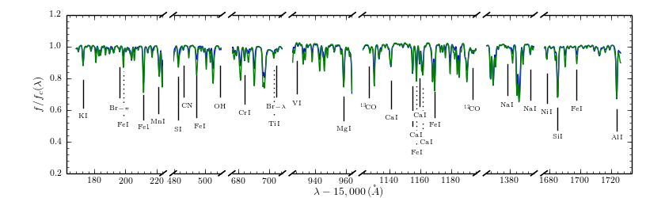

And for the Al variations in Al windows (re-using ``atm_ng`` from
higher up)::

	  abu= [13,-1.,-0.75,-0.5,-0.25,0.,0.25,0.5,0.75,1.]
	  synspec= apogee.modelspec.turbospec.windows('Al',abu,modelatm=atm_ng,\
	  	   linelist='201404080919')

and we can plot the aluminum windows::

    splot.windows(synspec[0],'Al')
    for ii in range(1,len(abu)-1): splot.windows(synspec[ii],'Al',overplot=True)

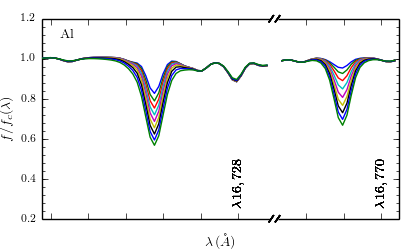

Again, the ``turbospec.windows`` synthesis is performed by first
synthesizing a single full APOGEE wavelength spectrum to use as a
baseline and then generating multiple synthetic spectra in the
requested windows for which the baseline is used outside of the
window. For most elements of interest this is very fast, because their
lines only span a narrow wavelength range: some quick testing seems to
indicate that as long as the total wavelength region spanned by an
element's windows is less than about 80 Angstrom, using the
``windows`` function is faster than synthesizing the whole
spectrum. The wavelength region spanned by an element's windows can be
computed with ``apogee.spec.window.total_dlambda``. The baseline can
be pre-computed using ``turbospec.turbosynth``, such that it can be
re-used when varying different elements. One has to generate the
baseline continuum, the continuum normalized spectrum, the wavelength
grid on which the synthesis is computed, but also the continuous
opacity, which can be saved to a file by specifying the ``modelopac=``
keyword. For example::

	 baseline= apogee.modelspec.turbospec.turbosynth(modelatm=atm_ng,\
	  	    linelist='201404080919',\
		    modelopac='mpac')
         mwav= baseline[0]
         cflux= baseline[2]/baseline[1]
         baseline= baseline[1]
	  
then we can repeat the calculation above as::

     	  synspec= apogee.modelspec.turbospec.windows('Al',abu,\
	              baseline=baseline,mwav=mwav,cflux=cflux,modelopac='mpac',\
		      modelatm=atm_ng,linelist='201404080919')

which is indistinguishable from the plot above. Remember that you end
up with a file that contains the continuous opacity, so you might want
to remove it again.

Fitting spectra
^^^^^^^^^^^^^^^^^

To replicate the APOGEE data analysis, one can use the APOGEE model
grids to fit a spectrum. This has been implemented here for the
overall six (or seven if you vary the microturbulence) parameter grid
as well as for fitting individual elements. For example, let's look
again at entry 3512 in the subsample of S/N > 200 stars in the DR12
red-clump catalog. Load the catalog::

	  import apogee.tools.read as apread
	  data= apread.rcsample()
	  indx= data['SNR'] > 200.
	  data= data[indx]
	
and now fit entry 3512::

    from apogee.modelspec import ferre
    # The following takes a while
    params= ferre.fit(data[3512]['LOCATION_ID'],data[3512]['APOGEE_ID'],
                      lib='GK',pca=True,sixd=True)
    print params
    [[  4.67245500e+03   2.64900000e+00   2.08730163e-01  -4.43000000e-01
  -6.40000000e-02   1.10000000e-01   4.90000000e-02]]

We can compare this to the official fit::

   fitparams= data[3512]['FPARAM']
   print fitparams
   [  4.67250000e+03   2.64860010e+00   2.08765045e-01  -4.42680001e-01
  -6.43979982e-02   1.10050000e-01   4.94019985e-02]
   print numpy.fabs(fitparams-params)
   [  4.50000000e-02   3.99898529e-04   3.48818403e-05   3.19998741e-04
   3.97998154e-04   5.00002503e-05   4.01998520e-04]

To initialize the fit by first running the ``Cannon`` (`Ness et
al. 2015 <http://arxiv.org/abs/1501.07604>`__; see below) with a
default set of coefficients, do (this is much faster than the standard
fit, because the standard fit starts from twelve different initial
conditions)::

   ferre.fit(data[3512]['LOCATION_ID'],data[3512]['APOGEE_ID'],
                    lib='GK',pca=True,sixd=True,initcannon=True)
   array([[  4.65617700e+03,   2.60000000e+00,   2.12986185e-01,
             -4.40000000e-01,  -1.29000000e-01,   1.30000000e-01,
             2.80000000e-02]])

This gives a fit that is very close to the standard ASPCAP fit.

To fix some of the parameters in the fit, do for example to just fit
``Teff``, ``logg``, and ``metals``::

   xparams= ferre.fit(data[3512]['LOCATION_ID'],data[3512]['APOGEE_ID'],
                     fixam=True,fixcm=True,fixnm=True,
                     lib='GK',pca=True,sixd=True)
   print xparams
   [[  4.69824100e+03   2.73600000e+00   2.01069231e-01  -4.21000000e-01
   0.00000000e+00   0.00000000e+00   0.00000000e+00]]

and compared to the previous results::

    from apogee.tools import paramIndx
    print (params-xparams)[paramIndx('Teff')]
    -25.786
    print (params-xparams)[paramIndx('logg')]
    -0.087
    print (params-xparams)[paramIndx('metals')]
    -0.022

In ``apogee.modelspec.ferre.fit`` we can also directly specify a
spectrum + spectrum error array instead of the ``location_id`` and
``apogee_id`` given above.

To fit for the abundances of individual elements use
``ferre.elemfit``. By default this function replicates the standard
ASPCAP fit: the grid dimension 'C', 'N', 'ALPHAFE', or 'METALS' is
varied based on whether the particular element is 'C', 'N', an alpha
element, or one of the remaining elements. For example, for the star
above we can get the Mg abundance by doing (we use ``params`` from
above as the baseline stellar-parameter fit)::

    mgparams= ferre.elemfit(data[3512]['LOCATION_ID'],data[3512]['APOGEE_ID'],
                      'Mg',params,
                      lib='GK',pca=True,sixd=True)

The output is the full standard 7D output, but only the 'ALPHAFE'
dimension was varied. Therefore, the [Mg/M] measurement is::

	  print mgparams[0,paramIndx('ALPHA')]
	  -0.007

which we can compare to the official data product, which is in
'FELEM'::

	from apogee.tools import elemIndx
	print data[3512]['FELEM'][elemIndx('Mg')]
	-0.0078463

To for example also let the effective temperature float in the Mg abundance fit you can do::

   mgparams= ferre.elemfit(data[3512]['LOCATION_ID'],data[3512]['APOGEE_ID'],
                      'Mg',params,
                      lib='GK',pca=True,sixd=True,fixteff=False)
   print mgparams[0,paramIndx('ALPHA')]
   -0.016

That is, the Mg abundance only changes by 0.01 dex. ``elemfit`` can also return an estimate of the error on the abundance, for example, do::

     mgparams, mgerr= ferre.elemfit(data[3512]['LOCATION_ID'],data[3512]['APOGEE_ID'],
                      'Mg',params,
                      lib='GK',pca=True,sixd=True,estimate_err=True)
     print mgparams[0,paramIndx('ALPHA')], mgerr
     -0.0068 [ 0.0519986]

If the estimated uncertainty is NaN, then it is larger than about 0.3
dex. To fully map the chi squared curve for a given element, you can
use ``ferre.elemchi2``. Clever use of this will also allow one to
investigate correlations between the elemental abundance and stellar
parameters.

To fit for all of the elemental abundances you can use ``elemfitall``,
which returns a dictionary of abundances relative to hydrogen for all
APOGEE elements::

	felem= ferre.elemfitall(data[3512]['LOCATION_ID'],data[3512]['APOGEE_ID'],fparam=params,lib='GK',pca=True,sixd=True)

We can compare this to the pipeline products, for example for Ni::

	print felem['Ni']
	[-0.453]
	print data[3512]['FELEM'][elemIndx('Ni')]
	-0.45136

or for Si (which in the standard pipeline product is given as [Si/Fe], so we have to add [Fe/H])::

	print felem['Si']
	[-0.204]
	print data[3512]['FELEM'][elemIndx('Si')]+params[:,paramIndx('METALS')] 
	[-0.20453]

``elemfitall`` can also estimate uncertainties in all of the
abundances by setting the keyword ``estimate_err=True``; uncertainties
are returned as keys 'e_X'.

Using The Cannon
^^^^^^^^^^^^^^^^^

This package has some (currently) limited functionality to apply the
``Cannon`` (`Ness et al. 2015 <http://arxiv.org/abs/1501.07604>`__) to
APOGEE data. So far, a linear or a quadratic fit for an arbitrary set
of labels is supported by ``apogee.spec.cannon.linfit`` and
``apogee.spec.cannon.quadfit``, which returns the coefficients of the
fit, the scatter, and possibly the residuals. Using the coefficients
to determine labels for a new spectrum is supported through
``apogee.spec.cannon.polylabels`` (although this implementation takes
a shortcut to avoid the necessary non-linear
optimization). ``apogee.spec.cannon.polylabels`` has a default set of
coefficients and scatter, so you can run for the example above (this
is what is used by the ``initcannon=True`` option of
``apogee.modelspec.ferre.fit`` above to initialize the FERRE fit)::

	     import apogee.spec.cannon
	     apogee.spec.cannon.polylabels(data[3512]['LOCATION_ID'],data[3512]['APOGEE_ID'])
	     array([[  4.80598726e+03,   2.22568929e+00,  -4.12532522e-01,
	               8.04473056e-02]])

which returns ``(Teff,logg,metals,[a/Fe])``. This default Cannon setup
was not trained on dwarfs, which will therefore come out in funny
parts of parameter space.

Stacking spectra
^^^^^^^^^^^^^^^^^

Very simple stacking functions are included in
``apogee.spec.stack``. Currently these consist of a (masked)
median-stacking routine and an inverse-variance stacking.

APOGEE 1 AND 2 SELECTION FUNCTIONS
==========================

Raw selection functions
^^^^^^^^^^^^^^^^^^^^^^^

One of the main uses of this codebase is that it can determine the
selection function---the fraction of objects in APOGEE's color and
magnitude range(s) successfully observed spectroscopically. This code
is contained in *apogee.select.apogeeSelect*. Because the selection function differs between APOGEE-1 (observations in SDSS-III) and APOGEE-2 (SDSS-IV), these survey selection functions need to be evaluated separately. Both functions are implemented as sub-classes of the ``apogeeSelect`` superclass. 

The selection function for APOGEE 1 is loaded using::

   import apogee.select.apogeeSelect
   apo= apogee.select.apogee1Select()

which will load the selection function for the full sample (this will
take a few minutes, and can take longer if the necessary files need to be downloaded, dependent on your connection). Replacing ``apogee1Select()`` with ``apogee2Select`` will load the selection function for APOGEE-2. For ``apogee2Select``, you can supply the ``hemisphere=`` keyword to select between APOGEE-2 `'north'` and `'south'` (by default this is set to `'north'`). If only
a few fields are needed, only those fields can be loaded by supplying
the *locations=* keyword, e.g.::

       apo= apogee.select.apogee1Select(locations=[4240,4241,4242])

will only load the fields *030+00*, *060+00*, and *090+00* (this functionality is also available in ``apogee2Select``). Locations
are identified using their location_id. Because loading the selection
function takes a long time, you might want to pickle it to save it
(this is supported); to reduce the size of the object and pickle, you
could ``del apo._specdata`` and ``del apo._photdata`` if you don't
want to make any plots (see below) with the unpickled object
(evaluating the selection function does not require these attributes).

The basic algorithm to determine the selection function is very simple:

* Only completed plates are considered
* Only completed cohorts are used; only stars observed as part of a completed cohort are considered to be part of the statistical sample (but, there is an initialization option *frac4complete* that can be used to set a lower completeness threshold; this still only uses complete plates)
* For any field/cohort combination, the selection function is the number of stars in the spectroscopic sample divided by the number of stars in the photometric sample (within the color and magnitude limits of the cohort).
* Only stars in APOGEE's main sample (selected using a dereddened *J-K*\ :sub:`s` > 0.5 color cut only, in the case of APOGEE-1) are included in the spectroscopic sample. See the function `apogee.tools.read.mainIndx <http://github.com/jobovy/apogee/blob/master/apogee/tools/read.py#L950>`__ for the precise sequence of targeting-flag cuts that define the main sample.

The selection function for APOGEE-1 can be evaluated (as a function) by calling the instance with the location_id and desired apparent H band magnitude. For example::

    apo(4240,11.8)
    0.0043398099560346048
    apo(4242,12.7)
    0.0094522019334049405
    apo(4242,12.9)
    0.

(all of the examples here use a preliminary version of the selection function for year1+2 APOGEE data; later versions might give slightly different answers and later years will give very different answers if the number of completed cohorts changes)

The latter is zero, because the long cohort for this field has not
been completed yet (as of year1+2). 

Evaluation of the APOGEE-2 selection function also requires a dereddened (J-Ks) colour as an argument, e.g.::
    
    apo(5155,11.8,0.6)
    0.1602803738317757
    apo(5155,11.8,0.9)
    0.9022988505747126
    apo(5155,13.,0.9)
    0.0
    
You can see that the redder color bins in APOGEE-2 have higher levels of completeness.

To get a list of all locations that are part of the statistical sample (i.e., that have at least a single completed cohort), do::

   locs= apo.list_fields(cohort='all') #to get all locations
   locs= apo.list_fields(cohort='short') #to get all locations with a completed short cohort
   locs= apo.list_fields(cohort='medium') #to get all locations with a completed medium cohort
   locs= apo.list_fields(cohort='long') #to get all locations with a completed long cohort
   
To get the H-band limits for a field's cohort do::

   apo.Hmin(4240,cohort='short')
   apo.Hmax(4240,cohort='short')
   
and similar for medium and long cohorts. We can also get the center of the plate in longitude and latitude, the radius within which targets are drawn, or the string name for each field::

    apo.glonGlat(4240)
    apo.radius(4240)
    apo.fieldName(4240)
    
The above functions work for both APOGEE-1 and 2 selection functions. The APOGEE-2 function can also return information about the color bins employed in the target selection for that survey::

    apo.NColorBins(5155)
    2 #this location had two (J-K) bins
    apo.JKmin(5155, bin=0)
    0.5
    apo.JKmax(5155, bin=0)
    0.800000011920929
    apo.JKmin(5155, bin=1)
    0.800000011920929
    apo.JKmax(5155, bin=1)
    999.9
    
The selection function can be plotted for both ``apogee1Select`` and ``apogee2Select`` objects using::

    apo.plot_selfunc_xy(vmax=15.) #for Galactic X and Y
    apo.plot_selfunc_xy(type='rz',vmax=15.) #For Galactocentric R and Z

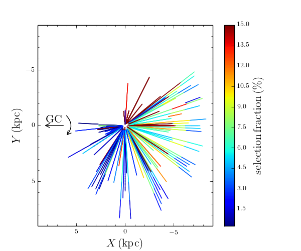

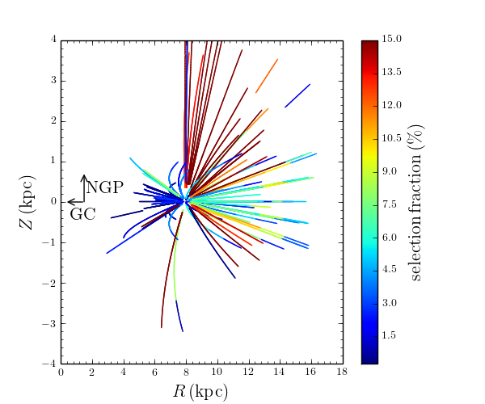
   
which gives a sense of the spatial dependence of the selection
function (which is really a function of *H* and not distance; *H* is
converted to distance here assuming a red-clump like absolute
magnitude and a fiducial extinction model). An optional ``color_bin`` keyword allows for plotting of the selection function in each color bin for APOGEE-2 (this defaults to the first bin if not set). The selection function for
a given cohort can also be plotted as a function of Galactic longitude
and latitude::

    apo.plot_selfunc_lb(cohort='short',type='selfunc',vmax=15.)

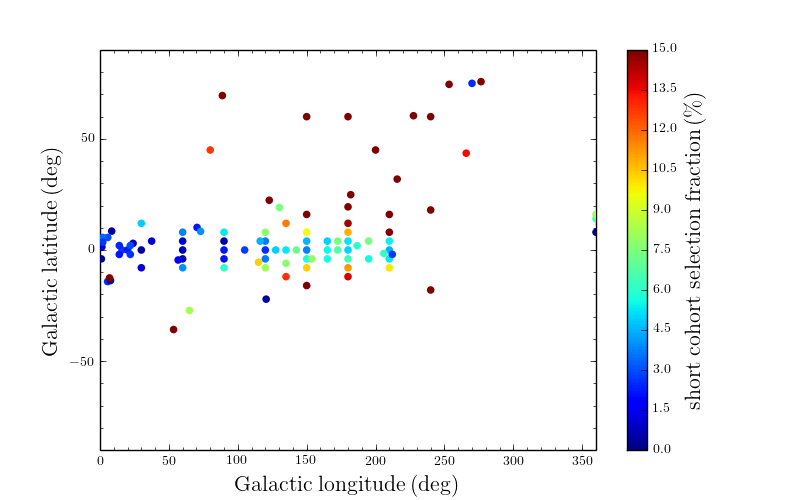

This function can also show the number of photometric and
spectroscopic targets, the H-band limits for each cohort, and the
probability that the spectroscopic sample was drawn from the
photometric sample (through use of the *type=* keyword).

The photometric sample's color--magnitude distribution can be shown,
as well as that of the spectroscopic sample and the photometric sample re-weighted using the selection function::

   apo.plotColorMag(bins=101,specbins=51,onedhistsbins=201,onedhistsspecbins=101,cntrSmooth=.75)

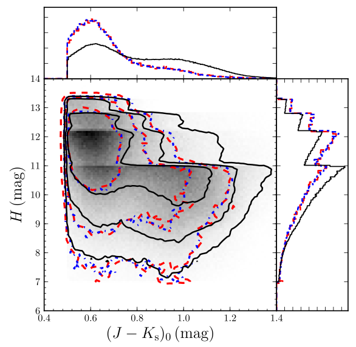

This allows one to see that the spectroscopic sample (red) is a fair
sampling of the underlying photometric sample (black), after
correcting for the (simple) selection function (blue). For individual
plates, the cumulative distribution in *H* can be compared for the
photometric and spectroscopic samples (correcting for the selection
fraction) using::

	  apo.plot_Hcdf(4242)

which shows this for all completed cohorts in field 4242 (*090+00*):

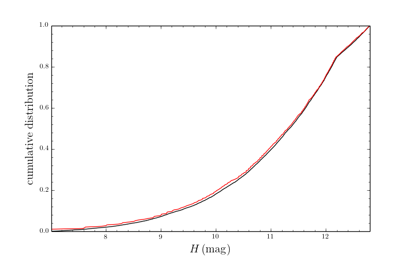

The red line is the spectroscopic sample and the black line the
photometric sample. We can calculate the K-S probability that the red
and black distributions are the same::

    apo.check_consistency(4242)
    0.76457183071108814

Thus, there is a very high probability that these two distributions
are the same.

The selection function instance also has a function that will
determine which stars in a given sample are part of the
**statistical** sample. For example, if one has started from the
*allStar* sample and performed some spectroscopic cuts, you can run
this sample through this function to see which stars are part of the
statistical sample, so that their relative frequency in the sample can
be adjust to reflect that of the underlying photometric sample. For
example,::

	import apogee.tools.read as apread
	allStar= apread.allStar(rmcommissioning=True,main=False,ak=True, akvers='targ',adddist=False)
	#Do some cuts to the sample
	allStar= allStar[various cuts]
	#Now which part of the sample is statistical?
	statIndx= apo.determine_statistical(allStar)

The array **statIndx** now is an boolean index array that identifies
the stars that are in the statistical sample.

Combining APOGEE-1 and 2 Selection Functions
^^^^^^^^^^^^^^^^^^^^^^^^^^^^^^^^^^^^^^^^^^^^^^

A detailed look at the *combined* selection function for the latest APOGEE DR16 release can be found as a jupyter notebook in this `gist
<https://gist.github.com/jobovy/47507a217409f152315323905edd711d>`__, but we can examine it's high level properties and access here.

The *combined* selection function of the APOGEE-1 and 2 surveys allows the use of the full available data set and includes data from SDSS-III and IV. We have implemented this through the ``apogeeCombinedSelect`` class, which is called as::

    apo = apogee.select.apogeeCombinedSelect(year = 7)
    
Specifying the year up to DR16. This loads an instance of ``apogee1Select`` and the northern and southern hemisphere instances of ``apogee2Select`` (which are stored inside the ``apogeeCombinedSelect`` object as ``apo.apo2Nsel`` and ``apo.apo2Ssel``), then combines them to make a single consistent selection function, which can be evaluated, as if it was the regular ``apogee2Select`` instance like::

    apo(4240,11.8,0.8)
    0.014097291164373848
    
since location 4240 is an APOGEE-1 location, it is simply evaluated as a location with a *single* color bin, and the APOGEE-1 selection fraction is returned. We can then re-plot the selection fraction on the sky for the entire APOGEE sample up to DR16, as before, using::

    apo.plot_selfunc_lb(cohort='short',type='selfunc',)
    
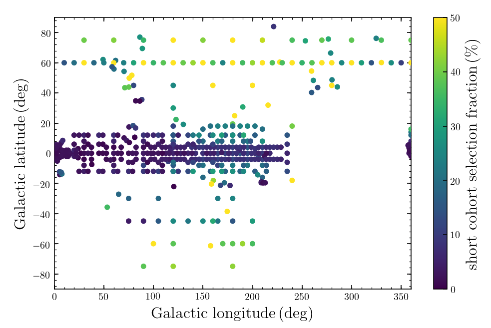

Which, by default, will plot the selection fraction for just the first of the color bins in any APOGEE-2 fields (this can be adjusted with the ``color_bin`` keyword, as before). Compared to the equivalent plot above, it is clear that APOGEE now covers a far larger portion of the sky than in DR12 (shown above), and with a far higher selection fraction in many fields.

We can also now re-plot the comparison between the spectroscopic and photometric color--magnitude distributions, now for the whole APOGEE data set, as before::

    apo.plotColorMag(bins=101,specbins=51,onedhistsbins=201,onedhistsspecbins=101,cntrSmooth=.8)
    
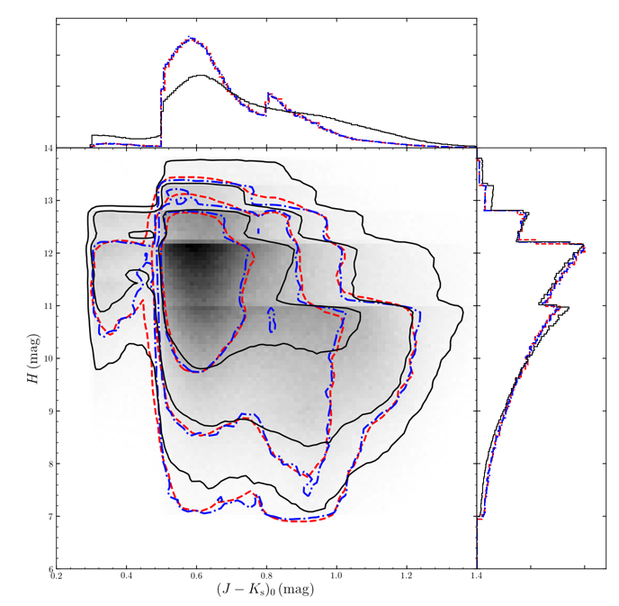

The newly adopted color binning in APOGEE-2 is clear in this plot, but we can see that the selection function still does a good job of re-weighting the underlying photometric sample (underlying in black, re-weighted in blue contours) to match the spectroscopic sample (red contours).  

As mentioned before, the loaded ``apogeeCombinedSelect`` object also contains the individual ``apogee1Select`` and ``apogee2Select`` objects, which can be accessed via ``apo.apo1sel``, ``apo.apo2Nsel`` and ``apo.apo2Ssel``, respectively. You can see that functionality in action in this  `jupyter notebook <https://gist.github.com/jobovy/47507a217409f152315323905edd711d>`__, which also does some further exploration of the selection and completeness of DR16.

Effective selection function
^^^^^^^^^^^^^^^^^^^^^^^^^^^^^^

As discussed in `Bovy, Rix, Schlafly et al. (2015)
<http://arxiv.org/abs/1509.XXXXX>`__ and `Bovy, Rix, Green et
al. (2015) <http://arxiv.org/abs/1509.XXXXX>`__, the selection
function can be efficiently used when fitting the spatial (or
phase-space) density profile of a stellar population through the use
of the *effective selection function*. This function encapsulates the
selection function itself, the three-dimensional extinction, and the
photometric-distance relation used to turn the *H*-band dependent
selection function *S(H,l,b,...)* (in APOGEE's case) into a selection
function in terms of distance *S(D,l,b)*. The latter is much easier to
use.

The ``apogee`` package contains a class that implements the effective
selection function for APOGEE. This functionality is included in
``apogee.select.apogeeSelect.apogeeEffectiveSelect``. The effective
selection function requires a three-dimensional extinction map (to
apply extinction when going from distance to magnitude), which has to
be provided as a ``mwdust.Dustmap3D`` object (see `mwdust
<https://github.com/jobovy/mwdust>`__). The initialization further
requires a raw APOGEE selection-function instance (see ``apo`` above - this can be an APOGEE 1, 2 or Combined selection function instance)
and a Monte Carlo sampling from the absolute *H* magnitude of the
tracer (this can be a single value for a standard candle; the default
is to use the red clump with *M_H = -1.49*)::

   from apogee.select.apogeeSelect import apogeeEffectiveSelect
   from mwdust import Green15
   g15= Green15(filter='2MASS H')
   apof= apogeeEffectiveSelect(apo,MH=-1.49,dmap3d=g15)

We can then evaluate the effective selection function as follows::

   apof(4240,[5.])
   array([ 0.01028933])

This returns the fraction of stars observed in the 4240 field
(*030+00*) at 5 kpc from the Sun (this function is much more efficient
for arrays). This function also takes the same ``MH=`` keyword that
the initialization takes, so you can override the object-wide default.

If using an APOGEE-2 or Combined selection function instance, one should also supply the ``JKO=`` keyword, which works similarly to the ``MH=`` keyword, in that it should be passed some representation of the dereddened (J-K) color distribution of the tracer which corresponds to the given absolute magnitude sampling. As an example, if using RGB stars in APOGEE, one could sample a set of isochrones in the APOGEE color and magnitude range, to gain a consistent sampling of the underlying absolute H magnitude and colour.

TOOLS FOR WORKING WITH INTERESTING APOGEE SUBSAMPLES
=====================================================

This codebase contains tools to characterize the properties of
different subsamples of the APOGEE data using stellar-evolution
models. In particular, it contains methods to reproduce the selection
of red clump (RC) stars as in `Bovy et al. 2014
<http://adsabs.harvard.edu/abs/2014ApJ...790..127B>`__, to calculate
the mean *K*\ :sub:`s` magnitude along the RC as a function of
metallity and color (Fig. 3 in that paper). The code also allows the
average RC mass, the amount of stellar-population mass represented by
each RC star, and the age distribution (Figs. 12, 13, and 14 in the
above paper) to be computed. The tools in this package are kept
general such that they can also be useful in defining other subsamples
in APOGEE.

RC catalog tools
^^^^^^^^^^^^^^^^^

The RC catalog is constructed by inspecting the properties of stellar
isochrones computed by stellar-evolution codes and finding the region
in surface-gravity--effective-temperature--color--metallicity space in
which the absolute magnitude distribution is extremely narrow
(allowing precise distances to be derived). The *apogee* toolbox can
load different stellar-isochrone models and compute their
properties. This is implemented in a general *apogee.samples.isomodel*
class; the code particular to the RC lives in *apogee.samples.rc*,
with *rcmodel* being the equivalent of the more general
*isomodel*. This code requires the `isodist
<http://github.com/jobovy/isodist>`__ library with accompanying data
files; see the *isodist* website for info on how to obtain this.

The actual code used to generate the APOGEE-RC catalog from the
general APOGEE catalog is included as `this script
<https://github.com/jobovy/apogee/blob/master/apogee/samples/make_rcsample.py>`__.

For example, we can load near-solar metallicity isochrones from the
`PARSEC <http://stev.oapd.inaf.it/cgi-bin/cmd>`__ library for the RC
using::

	from apogee.samples.rc import rcmodel
	rc= rcmodel(Z=0.02)

This command will take about a minute to execute. We can then plot the
isochrones, similar to Fig. 2 in the APOGEE-RC paper::

	    rc.plot(nbins=101,conditional=True)

which gives

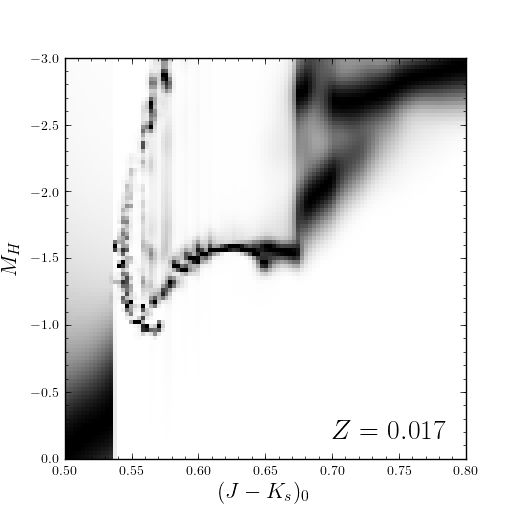

We can also calculate properties of the absolute magnitude distribution as a function of color::

   rc.mode(0.65)
   -1.659
   rc.sigmafwhm(0.65)
   0.086539636654887273

and we can make the same plot as above, but including the model, full-width, half-maximum, and the cuts that isolate the narrow part of the luminosity distribution::

    rc.plot(nbins=101,conditional=True,overlay_mode=True,overlay_cuts=True)

(this takes a while) which shows

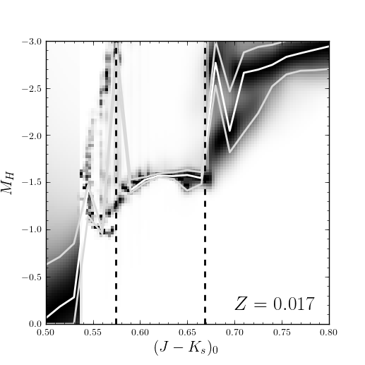

We can also compute the average mass of an RC star, the fraction of a
stellar population's mass is present in the RC, and the amount of
stellar population mass per RC star. These are all calculated as a
function of log10(age), so a grid of those needs to be specified::

	 lages= numpy.linspace(numpy.log10(0.8),1.,20)
	 amass= rc.avgmass(lages)
	 plot(lages,amass,'k-')

which gives

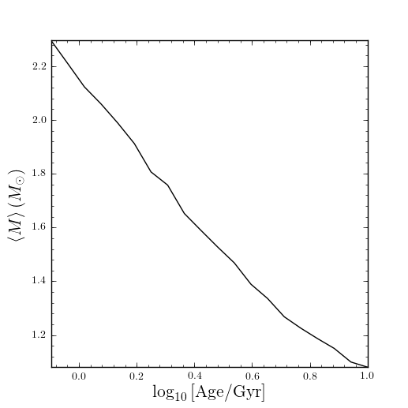

and::

	popmass= rc.popmass(lages)
	plot(lages,popmass,'k-')

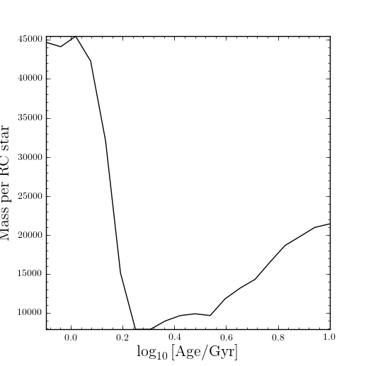

For convenience, the data in Figs. 3, 13, 14, and 15 in `Bovy et
al. 2014 <http://adsabs.harvard.edu/abs/2014ApJ...790..127B>`__ has
been stored as functions in this codebase. For example, we can
calculate distances as follows::

   from apogee.samples.rc import rcdist
   rcd= rcdist()
   rcd(0.65,0.02,11.)
   array([ 3.3412256])

where the inputs to *rcd* are *J-K*\ :sub:`s` color, metallicity *Z*
(converted from [Fe/H]), and the apparant *K*\ :sub:`s` magnitude.

We can also get the data from Figs. 13, 14, and 15. This can be
achieved as follows::

	 from apogee.samples.rc import rcpop
	 rcp= rcpop()

which sets up all of the required data. We can then get the average
mass etc.::

     rcp.avgmass(0.,0.) #[Fe/H], log10 age
     2.1543462571654866
     rcp.popmass(0.,0.)
     38530.337516523861

and we can plot them. E.g.::

    rcp.plot_avgmass()

produces Fig. 13 and::

	 rcp.plot_popmass()

gives the bottom panel of Fig. 14. We can also calculate the age
distribution::

	age_func= rcp.calc_age_pdf()

which returns a function that evaluates the age PDF for the
solar-neighborhood metallicity distribution assumed in the paper. We
can also directly plot it::

    rcp.plot_age_pdf()

which gives Fig. 15. More info on all of these functions is available
in the docstrings.
